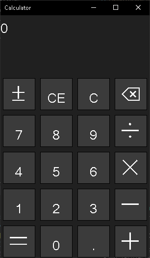

# W32Calc (Win32 Calculator)

This repository contains a simple calculator application built using the Win32 API. The calculator provides basic arithmetic operations and a graphical user interface (GUI) for easy interaction.



## Features

- Addition, subtraction, multiplication, and division operations.
- Clear button to reset the calculator.
- User-friendly interface with buttons for input and output display.

## Prerequisites

Before running the calculator application, ensure that you have the following prerequisites installed:

- Windows operating system (tested on Windows 10).
- Microsoft Visual Studio 2022 with C++ development tools.

## Installation

To install and run the calculator application, follow these steps:

1. Clone this repository to your local machine using the following command:
```
git clone https://github.com/Octopus-Computer/W32Calc.git
```
2. Open the project in Microsoft Visual Studio.

3. Build the project by selecting "Build" from the Visual Studio menu.

4. Run the application by selecting "Start Without Debugging" or pressing `Ctrl+F5`.

## Usage

1. Launch the calculator application.

2. Use the buttons provided to input numbers and perform calculations.

3. The result will be displayed in the calculator's output area.

4. To clear the calculator, click the "Clear" (C) button.

## Contributing

Contributions to this calculator application are welcome. If you find any issues or have suggestions for improvement, please feel free to open an issue or submit a pull request.

## License

This project is licensed under the [The MIT License](LICENSE).

## Acknowledgments

- The Win32 API documentation and examples.
- Inspiration from other calculator applications.

## Contact

If you have any questions or need further assistance, please feel free to contact the project maintainer at phamducduy6122011@gmail.com
